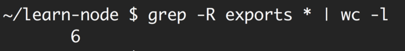
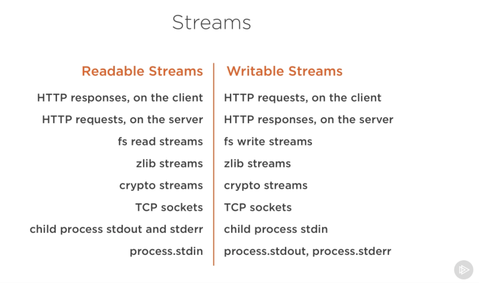
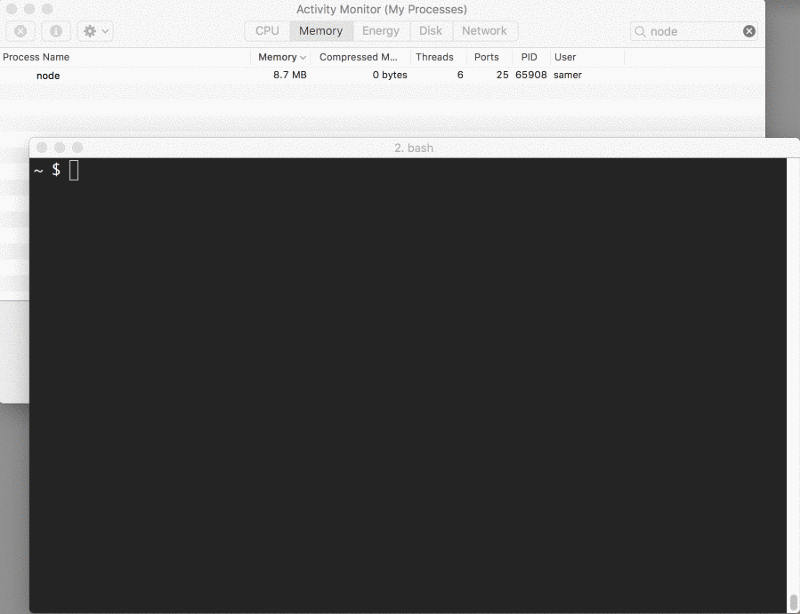
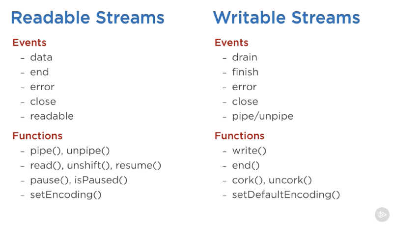
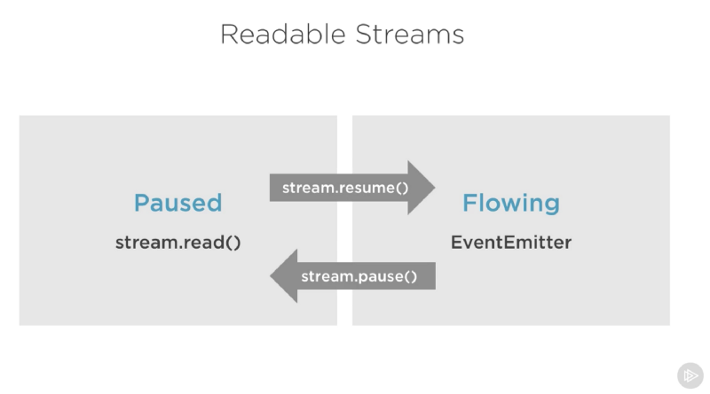
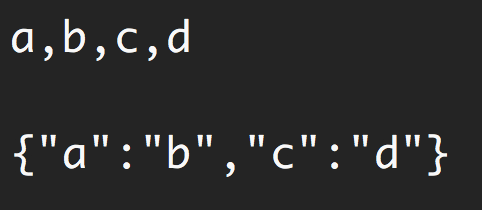

# Node.js Streams: Everything you need to know

Các Node.js streams nổi tiếng là khó làm việc và thậm chí khó hiểu. Vâng, tôi đã có một tin tốt cho bạn -- đó không còn là vấn đề nữa.

Trong những năm qua, các nhà phát triển đã tạo ra rất nhiều gói ngoài kia với mục đích duy nhất là làm việc với các streams dễ dàng hơn. Nhưng trong bài viết này, tôi sẽ tập trung vào [Node.js stream API](https://nodejs.org/api/stream.html).

> "Streams là ý tưởng hay nhất và bị hiểu lầm nhất của Node." - Dominic Tarr

### What exactly are streams?

Streams là tập hợp dữ liệu -- giống như mảng hoặc chuỗi. Sự khác biệt là các streams có thể không có sẵn cùng một lúc và chúng không phải nằm gọn trong bộ nhớ. Điều này làm cho các streams thực sự mạnh mẽ khi làm việc với một lượng lớn dữ liệu hoặc dữ liệu đến từ một nguồn bên ngoài một *chunk* tại một thời điểm (coming from an external source one chunk at a time).

Tuy nhiên, các streams không chỉ là về làm việc với dữ liệu lớn. Chúng cũng cung cấp cho chúng ta sức mạnh của khả năng kết hợp trong mã của chúng ta. Giống như chúng ta có thể soạn các lệnh Linux mạnh mẽ bằng cách kết hợp các lệnh Linux nhỏ hơn khác, chúng ta có thể thực hiện chính xác như vậy trong Node với các streams.



*Khả năng tương thích với các lệnh Linux*

```js
const grep = ... // A stream for the grep output
const wc = ... // A stream for the wc input

grep.pipe(wc)
```

Nhiều built-in modules trong Node thực thi streaming interface:



*Ảnh chụp màn hình được chụp từ khóa học Pluralsight của tôi -- Node.js nâng cao*

Danh sách trên có một số ví dụ cho các đối tượng Node.js gốc cũng có thể readable và writable streams. Một số đối tượng này là có thể cả readable và writable streams, như TCP sockets, zlib and crypto streams.

Lưu ý rằng các đối tượng đó cũng liên quan chặt chẽ. Mặc dù một HTTP response là readable stream trên client, nó là writable stream trên server. Điều này là do trong trường hợp HTTP, về cơ bản chúng ta đọc từ một đối tượng (`http.IncomingMessage`) và ghi tới một đối tượng khác (`http.ServerResponse`).

Cũng lưu ý cách `stdio` streams (`stdin`, `stdout`, `stderr`) có các kiểu stream ngược (inverse stream) khi nó đến các child processes. Điều này cho phép một cách thực sự dễ dàng để pipe đến và từ các streams này từ các main process `stdio` streams.

### Một ví dụ thực tế

Lý thuyết là tuyệt vời, nhưng thường không thuyết phục 100%. Chúng ta hãy xem một ví dụ minh họa các streams tạo ra sự khác biệt trong code khi nói đến mức tiêu thụ bộ nhớ.

Trước tiên hãy tạo một tệp lớn:

```js
const fs = require('fs');
const file = fs.createWriteStream('./big.file');

for(let i=0; i<= 1e6; i++) {
  file.write('Lorem ipsum dolor sit amet, consectetur adipisicing elit, sed do eiusmod tempor incididunt ut labore et dolore magna aliqua. Ut enim ad minim veniam, quis nostrud exercitation ullamco laboris nisi ut aliquip ex ea commodo consequat. Duis aute irure dolor in reprehenderit in voluptate velit esse cillum dolore eu fugiat nulla pariatur. Excepteur sint occaecat cupidatat non proident, sunt in culpa qui officia deserunt mollit anim id est laborum.\n');
}

file.end();
```

Hãy nhìn những gì tôi đã sử dụng để tạo tập tin lớn đó. Một writable stream!

Mô đun `fs` có thể được sử dụng để đọc và ghi vào các tệp sử dụng stream interface. Trong ví dụ trên, chúng ta đang ghi 1 triệu dòng tới `big.file` thông qua writable stream bằng một vòng lặp.

Chạy đoạn script trên tạo ra một tệp khoảng ~400 MB.

Đây là một simple Node web server được thiết kế để xử lý riêng cho `big.file`:

```js
const fs = require('fs');
const server = require('http').createServer();

server.on('request', (req, res) => {
  fs.readFile('./big.file', (err, data) => {
    if (err) throw err;

    res.end(data);
  });
});

server.listen(8000);
```

Khi máy chủ nhận được một request, nó sẽ xử lý the big file bằng phương thức không đồng bộ, `fs.readFile`. Nhưng này, không giống như chúng ta chặn vòng lặp sự kiện hay bất cứ điều gì. Mọi thứ đều tuyệt vời, phải không? Đúng?

Chà, hãy xem điều gì xảy ra khi chúng ta chạy máy chủ, kết nối với nó và theo dõi bộ nhớ trong khi làm như vậy.

Khi tôi chạy máy chủ, nó khởi động với dung lượng bộ nhớ bình thường, 8,7 MB:


Sau đó, tôi kết nối với máy chủ. Lưu ý những gì đã xảy ra với bộ nhớ tiêu thụ:



Wow -- mức tiêu thụ bộ nhớ đã tăng lên 434.8 MB.

Về cơ bản chúng ta đưa toàn bộ nội dung `big.file` vào bộ nhớ trước khi chúng ta viết nó ra cho response object. Điều này rất không hiệu quả.

The HTTP response object (`res` trong đoạn mã trên) cũng là một writable stream. Điều này có nghĩa là nếu chúng ta có một readable stream đại diện cho nội dung của `big.file`, chúng ta có thể kết nối hai thứ đó với nhau và đạt được kết quả tương tự mà không tốn ~400 MB bộ nhớ.

Node's `fs` module có thể cung cấp cho chúng ta một readable stream cho bất kỳ tệp nào bằng cách sử dụng phương thức `createReadStream`. Chúng ta có thể pipe dữ liệu đó đến response object:

```js
const fs = require('fs');
const server = require('http').createServer();

server.on('request', (req, res) => {
  const src = fs.createReadStream('./big.file');
  src.pipe(res);
});

server.listen(8000);
```

Bây giờ khi bạn kết nối với máy chủ này, một điều kỳ diệu sẽ xảy ra (nhìn vào mức tiêu thụ bộ nhớ):


*Chuyện gì đang xảy ra?*

Khi một client yêu cầu big file đó, chúng ta sẽ stream nó từng đoạn một (one chunk at a time), điều đó có nghĩa là chúng ta không buffer nó trong bộ nhớ. Việc sử dụng bộ nhớ tăng khoảng 25 MB và đó là nó.

Bạn có thể đẩy ví dụ này đến giới hạn của nó. Tạo lại `big.file` với năm triệu dòng thay vì chỉ một triệu, sẽ đưa tệp lên hơn 2 GB và thực sự lớn hơn giới hạn bộ đệm (buffer limit) mặc định trong Node.

Nếu bạn cố gắng xử lý tệp đó bằng cách sử dụng `fs.readFile`, bạn đơn giản là không thể theo mặc định (bạn có thể thay đổi the limits). Nhưng với `fs.createReadStream`, không có vấn đề gì trong việc truyền 2 GB dữ liệu đến requester, và tốt hơn cả, là việc process sử dụng bộ nhớ sẽ gần như tương tự nhau.

Sẵn sàng để học stream bây giờ?

> Bài viết này là một phần của [khóa học Pluralsight của tôi về Node.js](https://www.pluralsight.com/cifts/nodejs-advified). Tôi bao gồm nội dung tương tự ở định dạng video ở đó.

### Streams 101

Có bốn kiểu stream cơ bản trong Node.js: Readable, Writable, Duplex, and Transform streams.

- Một readable stream là một sự trừu tượng cho một nguồn mà data có thể được tiêu thụ. Một ví dụ về điều đó là phương thức `fs.createReadStream`.
- Một writable stream là một sự trừu tượng (abstraction) cho đích mà dữ liệu có thể được ghi. Một ví dụ về điều đó là phương thức `fs.createWriteStream`.
- Một duplex streams là có thể cả đọc và ghi được. Một ví dụ về điều đó là một TCP socket.
- Một transform stream về cơ bản là một duplex stream có thể được sử dụng để sửa đổi hoặc biến đổi dữ liệu khi được ghi và đọc. Một ví dụ về điều đó là `zlib.createGzip` stream để nén dữ liệu bằng gzip. Bạn có thể nghĩ về một transform stream là một hàm trong đó đầu vào là phần writable stream và đầu ra là phần readable stream. Bạn cũng có thể nghe thấy các transform streams được gọi là "*qua các luồng (through streams)*."

Tất cả các streams là các thực thể (instances) của `EventEmitter`. Chúng phát ra các sự kiện (emit events) có thể được sử dụng để đọc và ghi dữ liệu. Tuy nhiên, chúng ta có thể sử dụng streams data theo cách đơn giản hơn bằng cách sử dụng phương thức `pipe`.

#### The pipe method

Đây là dòng ma thuật mà bạn cần nhớ:

```js
readableSrc.pipe(writableDest)
```

Trong dòng đơn giản này, chúng ta đang dẫn đầu ra (piping) của một readable stream -- nguồn dữ liệu, là đầu vào của writable stream -- đích. Nguồn phải là một readable stream và đích phải là một writable stream. Tất nhiên, cả hai đều có thể là duplex/transform streams. Trên thực tế, nếu chúng ta piping tới một duplex stream, chúng ta có thể chain pipe calls giống như chúng ta làm trong Linux:

```js
readableSrc
  .pipe(transformStream1)
  .pipe(transformStream2)
  .pipe(finalWrtitableDest)
```

Phương thức `pipe` trả về stream đích, cho phép chúng ta thực hiện chaining ở trên. Đối với các streams `a` (readable), `b` và `c` (duplex), và `d` (writable), chúng ta có thể:

```js
a.pipe(b).pipe(c).pipe(d)

# Which is equivalent to:
a.pipe(b)
b.pipe(c)
c.pipe(d)

# Which, in Linux, is equivalent to:
$ a | b | c | d
```

Phương thức `pipe` là cách dễ nhất để tiêu thụ streams. Nói chung, nên sử dụng phương thức `pipe` hoặc tiêu thụ streams với các sự kiện (events), nhưng tránh trộn lẫn hai thứ này. Thông thường khi bạn đang sử dụng phương thức `pipe`, bạn không cần sử dụng các events, nhưng nếu bạn cần tiêu thụ các streams theo nhiều cách tùy chỉnh hơn, các events sẽ là cách tốt nhất.

#### Stream events

Bên cạnh việc đọc từ nguồn readable stream và ghi tới một writable stream đích, phương thức `pipe` sẽ tự động quản lý một số thứ trên đường đi. Ví dụ: nó xử lý các lỗi, end-of-files, và các trường hợp khi một stream chậm hơn hoặc nhanh hơn các stream khác.

Tuy nhiên, streams cũng có thể được tiêu thụ với các events trực tiếp. Đây là mã tương đương với sự kiện được đơn giản hóa về cách phương thức `pipe` chủ yếu làm để đọc và ghi dữ liệu:

```js
# readable.pipe(writable)

readable.on('data', (chunk) => {
  writable.write(chunk);
});

readable.on('end', () => {
  writable.end();
});
```

Dưới đây là danh sách các sự kiện và functions quan trọng có thể được sử dụng với các readable and writable streams:



*Ảnh chụp màn hình được chụp từ khóa học Pluralsight của tôi -- Node.js nâng cao*

Các events và functions có liên quan nào đó bởi vì chúng thường được sử dụng cùng nhau.

Các sự kiện quan trọng nhất trên một readable stream là:

- The `data` event, được emitted bất cứ khi nào stream truyền một a chunk đến consumer.
- The `end` event, được emitted khi không còn dữ liệu nào được tiêu thụ (consumed) từ stream.

Các sự kiện quan trọng nhất trên một writable stream là:

- The `drain` event, là tín hiệu cho thấy writable stream có thể nhận được nhiều dữ liệu hơn.
- The `finish` event, được emitted khi tất cả dữ liệu đã được flushed tới underlying system.

Các events and functions có thể được kết hợp để tạo ra việc tùy chỉnh và tối ưu hóa sử dụng của streams. Để sử dụng (consume) một readable stream, chúng ta có thể sử dụng các phương thức `pipe`/`unpipe` hoặc các phương thức `read`/`unshift`/`resume`. Để sử dụng (consume) một writable stream, chúng ta có thể biến nó thành đích của `pipe`/`unpipe`, hoặc chỉ cần viết tới nó bằng phương thức `write` và gọi phương thức `end` khi chúng ta hoàn thành.

#### Paused and Flowing Modes of Readable Streams

Readable streams có hai chế độ chính ảnh hưởng đến cách chúng ta có thể tiêu thụ (consume) chúng:

- Chúng có thể ở chế độ **paused**.
- Hoặc ở chế độ **chảy (flowing)**.

Những chế độ này đôi khi được gọi là chế độ kéo và đẩy (pull and push modes).

Tất cả các readable streams bắt đầu ở chế độ paused theo mặc định nhưng chúng có thể dễ dàng chuyển sang flowing và quay lại paused khi cần. Đôi khi, việc chuyển đổi xảy ra tự động.

Khi một readable stream ở chế độ paused, chúng ta có thể sử dụng phương thức `read()` để đọc từ stream theo yêu cầu, tuy nhiên, đối với readable stream ở chế độ flowing, dữ liệu sẽ liên tục chảy (continuously flowing) và chúng ta phải lắng nghe sự kiện để tiêu thụ (consume) nó.

Trong chế độ flowing, dữ liệu thực sự có thể bị mất nếu không có consumers nào sẵn sàng xử lý nó. Đây là lý do tại sao, khi chúng ta có một readable stream ở chế độ flowing, chúng ta cần một `data` event handler. Trong thực tế, chỉ cần thêm một `data` event handler sẽ chuyển một paused stream sang chế độ flowing và loại bỏ the `data` event handler sẽ chuyển stream  trở lại chế độ paused. Một số điều này được thực hiện để tương thích ngược với older Node streams interface.

Để chuyển đổi thủ công giữa hai chế độ stream này, bạn có thể sử dụng các phương thức `resume()` và `pause()`.



*Ảnh chụp màn hình được chụp từ khóa học Pluralsight của tôi -- Node.js nâng cao*

Khi tiêu thụ các readable streams bằng phương thức `pipe`, chúng ta không phải lo lắng về các chế độ này vì `pipe` tự động quản lý chúng.

### Thực thi luồng (Implementing Streams)

Khi chúng ta nói về các streams trong Node.js, có hai nhiệm vụ khác nhau chính:

- Nhiệm vụ của **thực thi (implementing)** các luồng.
- Nhiệm vụ của **tiêu thụ (consuming)** chúng.

Cho đến nay chúng ta chỉ đã nói về việc tiêu thụ các luồng (consuming streams). Hãy thực thi một chút! (Let's implement some!)

Stream implementers thường là những người `require` mô đun `stream`.

#### Implementing a Writable Stream

Để thực thi một writable stream, chúng ta cần sử dụng `Writable` constructor từ stream module.

```js
const { Writable } = require('stream');
```

Chúng ta có thể thực thi một writable stream theo nhiều cách. Ví dụ, chúng ta có thể extend the `Writable` constructor nếu muốn.

```js
class myWritableStream extends Writable {
}
```

Tuy nhiên, tôi thích cách tiếp cận simpler constructor hơn. Chúng ta chỉ cần tạo một đối tượng từ `Writable` constructor và truyền cho nó một số tùy chọn. Tùy chọn bắt buộc duy nhất là một `write` function trình bày chunk of data được ghi.

```js
const { Writable } = require('stream');

const outStream = new Writable({
  write(chunk, encoding, callback) {
    console.log(chunk.toString());
    callback();
  }
});

process.stdin.pipe(outStream);
```

Phương thức write này có ba đối số.

- The **chunk** thường là một bộ đệm (buffer) trừ khi chúng ta cấu hình stream khác.
- Đối số **encoding** là cần thiết trong trường hợp đó, nhưng thông thường chúng ta có thể bỏ qua nó.
- The **callback** là một function mà chúng ta cần gọi sau khi chúng ta xử lý xong the data chunk. Đó là những gì báo hiệu cho dù the write đã thành công hay không. Để báo hiệu lỗi, gọi callback với một error object.

Trong `outStream`, chúng ta chỉ đơn giản là `console.log` chunk dưới dạng một chuỗi và gọi `callback` sau đó mà không có lỗi để biểu thị thành công. Đây là một *echo* stream rất đơn giản và có thể không hữu ích. Nó sẽ echo back bất cứ điều gì nó nhận được.

Để consume stream này, chúng ta chỉ cần sử dụng nó với `process.stdin`, đây là một readable stream, vì vậy chúng ta có thể chuyển `process.stdin` vào `outStream`.

Khi chúng ta chạy mã ở trên, bất cứ điều gì chúng ta nhập vào `process.stdin` sẽ được echoed back bằng cách sử dụng dòng `outStream` `console.log`.

Đây không phải là một very useful stream để thực thi bởi vì nó thực sự đã được triển khai và tích hợp sẵn. Điều này rất giống với `process.stdout`. Chúng ta chỉ có thể chuyển `stdin` thành `stdout` và chúng ta sẽ có được tính năng echo giống hệt với dòng đơn này:

```js
process.stdin.pipe(process.stdout);
```

#### Implement a Readable Stream

Để thực thi một readable stream, chúng ta yêu cầu `Readable` interface, và xây dựng (construct) một đối tượng từ nó và thực thi một phương thức `read()` trong tham số cấu hình của stream:

```js
const { Readable } = require('stream');

const inStream = new Readable({
  read() {}
});
```

Có một cách đơn giản để thực thi các readable streams. Chúng ta chỉ cần trực tiếp `push` dữ liệu mà chúng ta muốn consumers  tiêu thụ.

```js
const { Readable } = require('stream');

const inStream = new Readable({
  read() {}
});

inStream.push('ABCDEFGHIJKLM');
inStream.push('NOPQRSTUVWXYZ');

inStream.push(null); // No more data

inStream.pipe(process.stdout);
```

Khi chúng ta `push` một `null` object, điều đó có nghĩa là chúng ta muốn báo hiệu rằng stream không có thêm dữ liệu.

Để consume (tiêu thụ) readable stream giản này, chúng ta có thể đơn giản pipe nó vào writable stream `process.stdout`.

Khi chúng ta chạy mã ở trên, chúng ta sẽ đọc tất cả dữ liệu từ `inStream` và echoing mã đó tới standard out. Rất đơn giản, nhưng cũng không hiệu quả lắm.

Về cơ bản, chúng ta đang đẩy (pushing) tất cả dữ liệu trong stream *trước khi* piping nó tới `process.stdout`. Cách tốt hơn nhiều là đẩy dữ liệu *theo yêu cầu*, khi consumer yêu cầu. Chúng ta có thể làm điều đó bằng cách thực thi phương thức `read()` trong configuration object:

```js
const inStream = new Readable({
  read(size) {
    // there is a demand on the data... Someone wants to read it.
  }
});
```

Khi phương thức read được gọi trên một readable stream, việc thực thi có thể push một phần dữ liệu vào hàng đợi. Ví dụ: chúng ta có thể push từng chữ cái một, bắt đầu bằng mã ký tự 65 (đại diện cho A) và tăng ký tự đó trên mỗi lần đẩy:

```js
const inStream = new Readable({
  read(size) {
    this.push(String.fromCharCode(this.currentCharCode++));
    if (this.currentCharCode > 90) {
      this.push(null);
    }
  }
});

inStream.currentCharCode = 65;

inStream.pipe(process.stdout);
```

Trong khi consumer đang đọc một readable stream, phương thức `read` sẽ tiếp tục kích hoạt, và chúng ta sẽ đẩy nhiều chữ cái hơn. Chúng ta cần dừng chu trình này ở đâu đó và đó là lý do tại sao một câu lệnh if sẽ đẩy null khi currentCharCode lớn hơn 90 (đại diện cho Z).

Mã này tương đương với mã đơn giản hơn mà chúng ta đã bắt đầu nhưng bây giờ chúng ta đang đẩy dữ liệu theo yêu cầu khi consumer yêu cầu. Bạn nên luôn luôn làm điều đó.

#### Implementing Duplex/Transform Streams

Với các duplex streams, chúng ta có thể thực thi cả các readable and writable streams với cùng một đối tượng. Như thể chúng ta kế thừa từ cả hai interfaces.

Dưới đây là một ví dụ duplex stream kết hợp hai writable and readable được triển khai ở trên:

```js
const { Duplex } = require('stream');

const inoutStream = new Duplex({
  write(chunk, encoding, callback) {
    console.log(chunk.toString());
    callback();
  },

  read(size) {
    this.push(String.fromCharCode(this.currentCharCode++));
    if (this.currentCharCode > 90) {
      this.push(null);
    }
  }
});

inoutStream.currentCharCode = 65;

process.stdin.pipe(inoutStream).pipe(process.stdout);
```

Bằng cách kết hợp các phương thức, chúng ta có thể sử dụng duplex stream để đọc các chữ cái từ A đến Z và chúng ta cũng có thể sử dụng nó cho tính năng echo của nó. Chúng ta pipe readable `stdin` stream vào duplex stream này để sử dụng tính năng echo và chúng ta pipe chính duplex stream vào writable `stdout` stream để xem các chữ cái từ A đến Z.

Điều quan trọng là phải hiểu rằng các mặt readable và writable của duplex stream hoạt động hoàn toàn độc lập với nhau. Đây chỉ đơn thuần là nhóm hai tính năng thành một đối tượng.

một transform stream thú vị hơn là duplex stream vì đầu ra của nó được tính từ đầu vào của nó.

Đối với một transform stream, chúng ta không phải thực thi các phương thức `read` hoặc `write`, chúng ta chỉ cần thực thi một phương thức `transform`, mà đã kết hợp cả hai phương thức. Nó có signature của phương thức `write` và chúng ta cũng có thể sử dụng nó để `push` dữ liệu.

Đây là một simple transform stream mà sẽ echoes back bất cứ thứ gì bạn nhập vào sau khi chuyển đổi nó sang định dạng chữ hoa:

```js
const { Transform } = require('stream');

const upperCaseTr = new Transform({
  transform(chunk, encoding, callback) {
    this.push(chunk.toString().toUpperCase());
    callback();
  }
});

process.stdin.pipe(upperCaseTr).pipe(process.stdout);
```

Trong transform stream này, chúng ta đang tiêu thụ (consuming) chính xác như ví dụ duplex stream trước đó, chúng ta chỉ thực hiện một phương thức `transform()`. Trong phương thức đó, chúng ta convert the `chunk` thành phiên bản chữ hoa và sau đó là `push` phiên bản đó thành phần readable.

#### Streams Object Mode

Theo mặc định, các streams mong đợi các giá trị Buffer/String. Có một `objectMode` flag mà chúng ta có thể đặt để stream chấp nhận bất kỳ đối tượng JavaScript nào.

Đây là một ví dụ đơn giản để chứng minh điều đó. Sự kết hợp các transform streams sau đây làm cho một tính năng map một chuỗi các giá trị được phân tách bằng dấu phẩy thành một đối tượng JavaScript. Vì vậy `"a,b,c,d"` trở thành `{a: b, c: d}`.

```js
const { Transform } = require('stream');

const commaSplitter = new Transform({
  readableObjectMode: true,

  transform(chunk, encoding, callback) {
    this.push(chunk.toString().trim().split(','));
    callback();
  }
});

const arrayToObject = new Transform({
  readableObjectMode: true,
  writableObjectMode: true,

  transform(chunk, encoding, callback) {
    const obj = {};
    for(let i=0; i < chunk.length; i+=2) {
      obj[chunk[i]] = chunk[i+1];
    }
    this.push(obj);
    callback();
  }
});

const objectToString = new Transform({
  writableObjectMode: true,

  transform(chunk, encoding, callback) {
    this.push(JSON.stringify(chunk) + '\n');
    callback();
  }
});

process.stdin
  .pipe(commaSplitter)
  .pipe(arrayToObject)
  .pipe(objectToString)
  .pipe(process.stdout)
```

Chúng ta chuyển chuỗi đầu vào (ví dụ: `"a,b,c,d"`) thông qua `commaSplitter` để đẩy một mảng thành readable data của nó (`["a", "b", "c", "d"]`). Việc thêm cờ `readableObjectMode` trên stream đó là cần thiết bởi vì chúng ta đang đẩy một đối tượng ở đó, không phải là một chuỗi.

Sau đó chúng ta lấy mảng và dẫn nó vào `arrayToObject` stream. Chúng ta cần một cờ `writableObjectMode` để làm cho stream đó chấp nhận một đối tượng. Nó cũng sẽ đẩy một đối tượng (mảng đầu vào được ánh xạ (mapped) vào một đối tượng) và đó là lý do tại sao chúng ta cũng cần cờ `readableObjectMode` ở đó. `objectToString` stream cuối cùng chấp nhận một đối tượng nhưng đẩy ra một chuỗi và đó là lý do tại sao chúng ta chỉ cần một cờ `writableObjectMode` ở đó. Phần readable là một chuỗi bình thường (the stringified object).



*Usage of the example above*

#### Node's built-in transform streams

Node có một vài built-in transform streams rất hữu ích. Cụ thể, các zlib và crypto streams.

Dưới đây là một ví dụ sử dụng the `zlib.createGzip()` stream kết hợp với các `fs` readable/writable streams để tạo file-compression script:

```js
const fs = require('fs');
const zlib = require('zlib');
const file = process.argv[2];

fs.createReadStream(file)
  .pipe(zlib.createGzip())
  .pipe(fs.createWriteStream(file + '.gz'));
```

Bạn có thể sử dụng script này để gzip bất kỳ tệp nào bạn truyền làm đối số. Chúng ta đang truyền một readable stream cho tệp đó vào zlib built-in transform stream và sau đó thành một writable stream cho tệp gzipped mới. Đơn giản.

Điều thú vị của việc sử dụng pipes là chúng ta thực sự có thể kết hợp chúng với các sự kiện nếu chúng ta cần. Ví dụ, tôi muốn user thấy một chỉ báo tiến trình (progress indicator) trong khi script đang làm việc và một thông báo "Done" khi script được hoàn thành. Vì phương thức `pipe` trả về stream đích, chúng ta cũng có thể xâu chuỗi (chain) đăng ký (registration) của các events handlers:

```js
const fs = require('fs');
const zlib = require('zlib');
const file = process.argv[2];

fs.createReadStream(file)
  .pipe(zlib.createGzip())
  .on('data', () => process.stdout.write('.'))
  .pipe(fs.createWriteStream(file + '.zz'))
  .on('finish', () => console.log('Done'));
```

Vì vậy, với phương thức `pipe`, chúng ta có thể dễ dàng tiêu thụ các luồng (consume streams), nhưng chúng ta vẫn có thể tùy chỉnh thêm tương tác của mình với các streams đó bằng các sự kiện khi cần thiết.

Điều tuyệt vời về phương thức `pipe` là chúng ta có thể sử dụng nó để *soạn (compose)* từng phần chương trình của mình theo cách dễ đọc. Ví dụ, thay vì listening the `data` event ở trên, chúng ta chỉ cần tạo một transform stream để báo cáo tiến trình (report progress), và thay thế cuộc gọi `.on()` bằng một cuộc gọi `.pipe()` khác:

```js
const fs = require('fs');
const zlib = require('zlib');
const file = process.argv[2];

const { Transform } = require('stream');

const reportProgress = new Transform({
  transform(chunk, encoding, callback) {
    process.stdout.write('.');
    callback(null, chunk);
  }
});

fs.createReadStream(file)
  .pipe(zlib.createGzip())
  .pipe(reportProgress)
  .pipe(fs.createWriteStream(file + '.zz'))
  .on('finish', () => console.log('Done'));
```

`reportProgress` stream này là một stream truyền qua đơn giản (simple pass-through stream), nhưng nó cũng báo cáo tiến trình theo tiêu chuẩn. Lưu ý cách tôi đã sử dụng đối số thứ hai trong hàm `callback()` để đẩy dữ liệu bên trong phương thức `transform()`. Điều này tương đương với việc đẩy dữ liệu đầu tiên.

Các ứng dụng kết hợp các streams là vô tận. Ví dụ: nếu chúng ta cần mã hóa tệp trước hoặc sau khi chúng ta gzip nó, tất cả những gì chúng ta cần làm là chuyển một transform stream khác theo thứ tự chính xác mà chúng ta cần. Chúng ta có thể sử dụng mô đun `crypto` của Node cho điều đó:

```js
const crypto = require('crypto');
// ...

fs.createReadStream(file)
  .pipe(zlib.createGzip())
  .pipe(crypto.createCipher('aes192', 'a_secret'))
  .pipe(reportProgress)
  .pipe(fs.createWriteStream(file + '.zz'))
  .on('finish', () => console.log('Done'));
```

Kịch bản trên nén và sau đó mã hóa tệp đã qua và chỉ những người có secret mới có thể sử dụng tệp xuất ra. Chúng tôi không thể giải nén tệp này với các tiện ích giải nén thông thường vì nó được mã hóa.

Để thực sự có thể giải nén bất cứ thứ gì được nén bằng tập lệnh ở trên, chúng ta cần sử dụng các streams ngược lại cho crypto và zlib theo thứ tự ngược lại, rất đơn giản:

```js
fs.createReadStream(file)
  .pipe(crypto.createDecipher('aes192', 'a_secret'))
  .pipe(zlib.createGunzip())
  .pipe(reportProgress)
  .pipe(fs.createWriteStream(file.slice(0, -3)))
  .on('finish', () => console.log('Done'));
```

Giả sử tệp đã truyền là phiên bản nén, đoạn mã trên sẽ tạo ra một luồng đọc (read stream) từ đó, dẫn nó vào crypto `createDecipher()` stream (sử dụng cùng một secret), chuyển đầu ra của nó vào zlib `createGunzip()` stream, và sau đó ghi lại mọi thứ vào một tệp mà không có phần mở rộng.

Đó là tất cả những gì tôi có cho chủ đề này. Cảm ơn vì đã đọc! Cho đến lần sau!

* * * * *

Learning React or Node? Checkout my books:

- [Learn React.js by Building Games](http://amzn.to/2peYJZj)
- [Node.js Beyond the Basics](http://amzn.to/2FYfYru)

